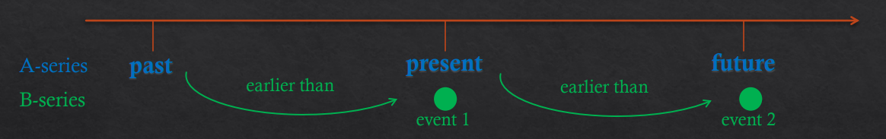

# Mctaggart on The Unreality of Time 
## McTaggart's Thesis: Time is not real 

### A Series 
> All events are ordered by "far past" .. "past" .. "present" .. "near future" .. etc 
- Things change from being future, and then move into then the present, then the past
- This change would exist with otr without thinkers
- To be really "real" is to be in the present. 
- A theorists believe that only the present is the reality
- presentness moves forward in what we call the future 
### B Series
> All events are ordered by the "earlier than" relation
- Things happen earlier than other things
    - The past present and future do not differ other than the fact they are relative t what we consider in the now
- "Being earlier" never changes
- The past, present, and future, are equally real 
- The "now" is like "here", it is equally real what came earlier than 
    - There is also no idea of objective "now" which meshes well with Einsteins physics 
## Mctaggarts Argument 
- 